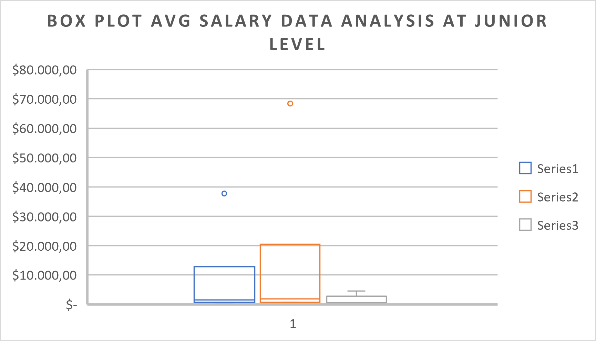
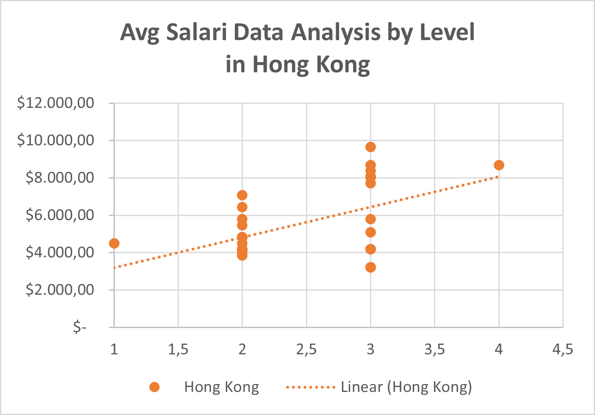
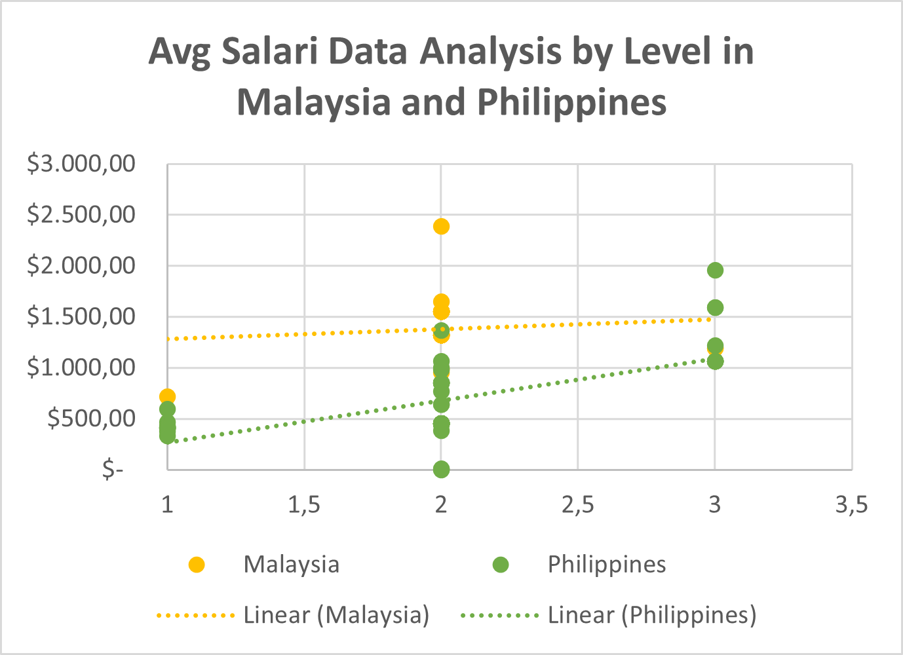

# Data_Analysis_Job_Specialisation_Dashboard
This project analyzes Data Analysis Job Specializations across Asia–Pacific using open-source data from Kaggle.
It includes full data processing with SQL, exploratory data analysis (EDA) using Excel, and an interactive dashboard summarizing job distribution, average salary, and work modes.
Insights reveal significant salary gaps (notably in Australia), a dominance of remote jobs (73%), and a clear correlation between job level and salary.
The final dashboard visualizes salary trends, country comparisons, and key job metrics for data analyst roles.
Created as a portfolio project to demonstrate skills in data cleaning, visualization, and storytelling through data.

📘 **Dataset Source:**  
Dataset of IT Job Vacancies and Requirements in the Asia-Pacific Region  
👉 [Kaggle - Sergey Chekurin (2024)](https://www.kaggle.com/datasets/sergeychekurin/it-jobs-in-asia-pacific-region-may-june-2024)

# Data Analysis Job Specialisation Dashboard

## 🧭 Overview
This project explores IT job vacancies in the Asia–Pacific region, focusing on **Data Analysis** roles at the **Junior level**.  
It highlights how salaries vary across countries and how career levels influence compensation.

### 🎯 Objectives
- Identify IT job data analysis specialization at the junior level.  
- Explore salary distribution by country and job level.  
- Translate findings into clear, actionable insights.

---

## 🗃️ Data Preparation
Data was collected from a database using SQL.  
Script file: `data_preparation_to_excel.sql` (available in the [Data_Analysis_Job_Specialisation_Dashboard](data_preparation_to_excel.sql) repository).

---

## 🔍 Exploratory Analysis

### 🌏 Summary of Findings
**Country Coverage:**  
The dataset covers Australia, Hong Kong, Singapore, Philippines, Malaysia, Indonesia, New Zealand, and Thailand.

**Job Distribution:**  
- Data Analysis roles make up only about **7%** of total IT jobs in each country.  
- **Australia** leads in both job count and salary for Junior-level roles.

**Salary Comparison (Exploratory 1):**  
- Highest average salaries: **Australia ($32,983.40)** and **Hong Kong ($3,509.67)**.  
- Lower averages (< $1,000): **Philippines, Malaysia, and Thailand**.  
- The `salary_status` column classifies countries as **Higher**, **Good**, or **Lower** based on global averages.

**Statistical Insights:**  

- **Box Plot:** Australia stands out as an outlier with salaries far above the upper limit.

  
  

 
- **Scatter Plot:** A clear upward salary trend appears from **Junior → Lead → Senior**.  
- The relationship between level and salary is strongest in **Hong Kong, Philippines, and Malaysia**, though some anomalies show Senior roles earning slightly more than Lead.

**Preliminary Conclusion:**  
- Significant salary gaps exist among Asia–Pacific countries.  
- Australia dominates in both job count and pay but is a statistical outlier.  
- Salary growth aligns with job level, indicating a strong career progression pattern in Data Analysis.

🖼️ Visuals available in  
`Data_Analysis_Job_Specialisation_Dashboard/images/`:  
- `BoxPlot_Exploratory2.png`  
- `ScatterPlot_Exploratory2.png`

---

## 📊 Dashboard
Final interactive dashboard visualization:  

---

## 💡 Insights (Simple Explanation)
- **The Philippines** offers the **most junior-level IT job openings (576)**, followed by **Hong Kong (343)** and **Malaysia (336)**.  
- For **Data Analysis** roles, the top three countries are **Philippines (12)**, **Singapore (9)**, and **Thailand (6)**.  
- The **highest average salary for a Junior Data Analyst** is in **Australia ($37,721.62)** — higher than the overall IT junior average.  
  Next are **Hong Kong ($4,504.50)** and **Singapore ($2,240.83)**.  
- The **maximum salary** also peaks in **Australia ($68,367.62)**, showing a large pay gap (outlier).  
- In the **Box Plot**, Australia’s average and maximum salaries are far above other countries.  
- The **Scatter Plot** shows that as job levels go up, salaries tend to rise — especially in Hong Kong, Philippines, and Malaysia.  
  Still, in some cases, Senior roles earn slightly more than Lead positions in the same country.

---

## 🧩 Recommendations

### 👩‍💻 For Job Seekers
- Consider **Philippines, Malaysia, or Hong Kong** if you’re looking to start a career in IT at the **Junior level** — they have plenty of entry opportunities.  
- If your focus is **Data Analysis**, **Australia** offers the best salary potential — but expect stronger competition.

### 🏢 For Companies and HR Teams
- Use **country and job-level salary benchmarking** to design fair and competitive pay packages.  
- Monitor and address **salary gaps** to retain skilled professionals and ensure internal equity.

---

## 👤 Author
**Faturahman**  
Aspiring Data Analyst  
📍 Bandung, Indonesia  
🔗 [www.linkedin.com/in/faturahman183] • [233419245+faturahman03@users.noreply.github.com]

